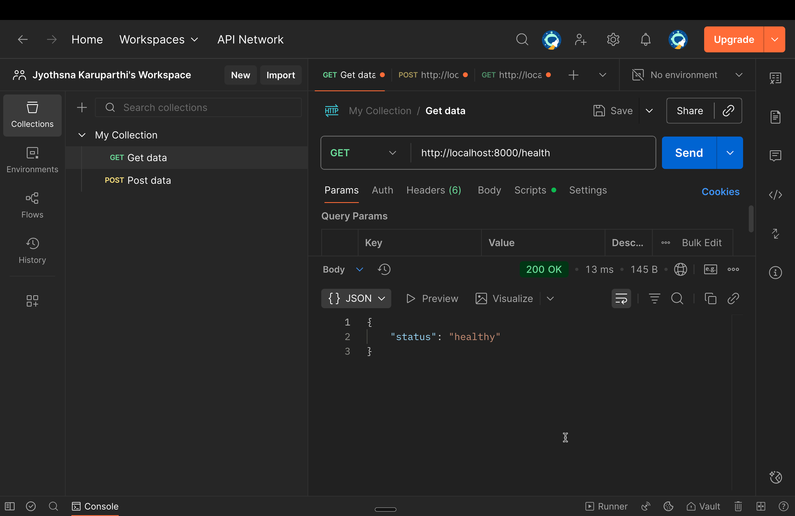
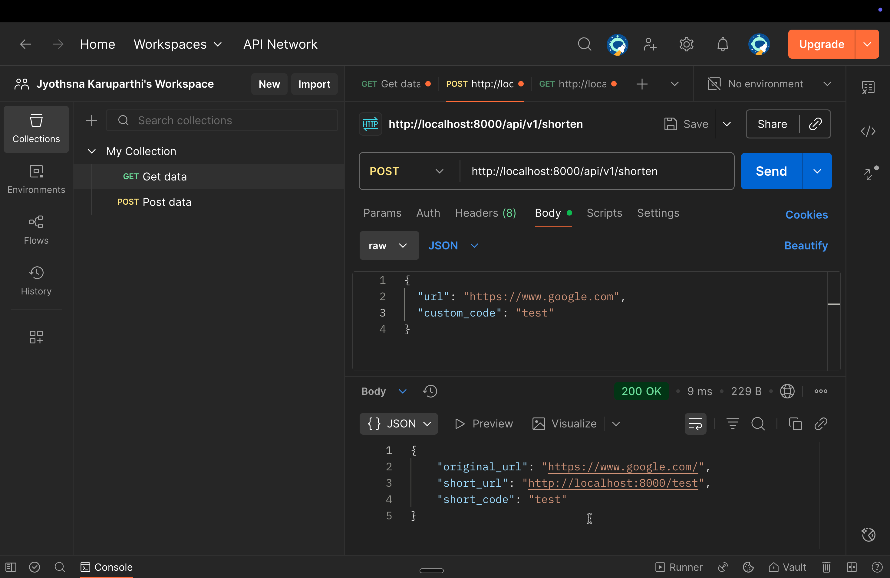
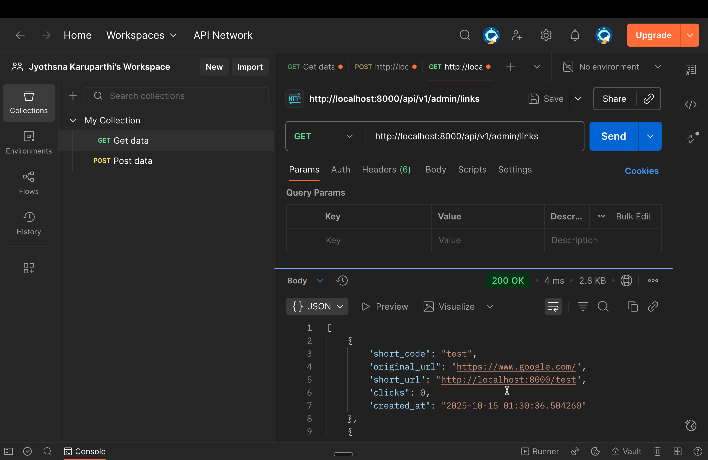
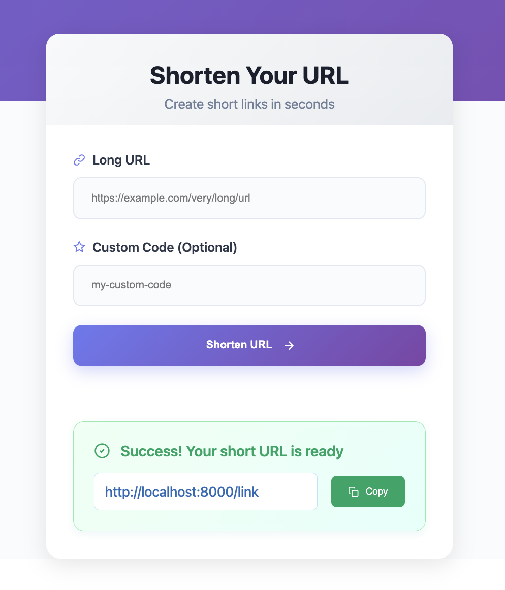
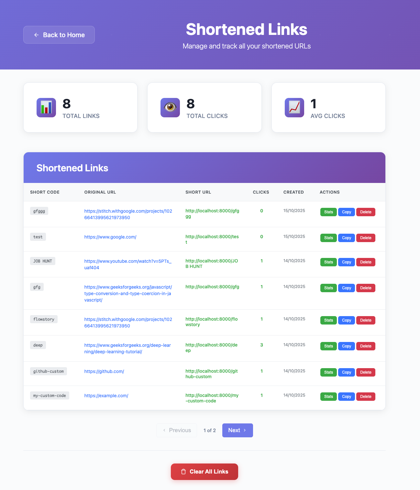

# ChopURL - Full-Stack URL Shortener

A full-stack URL-shortening portfolio project built with a FastAPI backend and Vue 3 frontend. ChopURL supports public URL shortening, custom short codes, click analytics, Supabase authentication, password reset, and an authenticated dashboard for managing your own links.

 <p align="center">
  
 </p>

---

## Table of Contents

1. [Features](#features)
2. [Tech Stack](#tech-stack)
3. [Project Structure](#project-structure)
4. [Prerequisites](#prerequisites)
5. [Local Development Setup](#local-development-setup)
6. [Environment Variables](#environment-variables)
7. [API Documentation](#api-documentation)
8. [Testing](#testing)
9. [Local Development](#local-development)
10. [Suggested Next Steps](#suggested-next-steps)
11. [Contributing](#contributing)
12. [License](#license)

---

## Features

### Core Functionality

- **Public URL Shortening**
  Shorten a URL from the home page without needing to sign in.

- **Custom Short Links**  
  Create your own custom short codes for memorable URLs. Choose any short code you want for your links.

- **Click Tracking**  
  Monitor click counts for each shortened link. ChopURL records total clicks, last clicked time, and recent click history.

- **Instant Redirects**  
  Redis-backed URL lookup for straightforward short-link redirects.

- **Supabase Authentication**
  Sign up with username, email, password, and confirm password. Sign in, sign out, and reset forgotten passwords through Supabase Auth.

- **Link Management**  
  Signed-in users can view, copy, inspect, delete, and clear their own shortened links from the dashboard.

- **Owner-Scoped Admin Dashboard**
  Authenticated dashboard routes only return links created by the current signed-in user.

---

## Tech Stack

### **Backend**
- **FastAPI** - Modern, fast web framework for building APIs
- **Redis** - In-memory data store for short-code lookups and click metadata
- **Python 3.11+** - High-performance backend language
- **Pydantic** - Data validation and settings management
- **PyJWT + httpx** - Supabase token verification

### **Frontend**
- **Vue 3** - Progressive JavaScript framework
- **Vite** - Lightning-fast build tool and dev server
- **Vue Router** - Client-side routing
- **Axios** - HTTP client for API communication
- **Supabase JS** - Frontend authentication client

### **Infrastructure**
- **Redis** - In-memory database for caching and sessions
- **Supabase Auth** - User signup, login, session, and password reset
- **CORS** - Cross-origin resource sharing for local frontend/backend development
- **Environment Variables** - Secure configuration management

---

## Project Structure

```
chopurl/
├── backend/
│   ├── app/
│   │   ├── main.py
│   │   ├── api/
│   │   │   └── routers.py
│   │   ├── core/
│   │   │   ├── auth.py
│   │   │   └── config.py
│   │   ├── db/
│   │   │   └── redis_client.py
│   │   ├── models/
│   │   │   └── schemas.py
│   │   ├── services/
│   │   │   └── links.py
│   │   └── utils/
│   │       └── hashids.py
│   ├── tests/
│   │   └── test_links_service.py
│   ├── .env.example
│   └── requirements.txt
├── admin/
│   ├── src/
│   │   ├── components/
│   │   │   ├── ShortenForm.vue
│   │   │   ├── LinksTable.vue
│   │   │   └── StatsModal.vue
│   │   ├── views/
│   │   │   ├── Home.vue
│   │   │   ├── Links.vue
│   │   │   └── Login.vue
│   │   ├── router/
│   │   ├── auth.js
│   │   ├── api.ts
│   │   ├── main.js
│   │   └── supabase.js
│   ├── public/
│   │   └── favicon.png
│   ├── .env.example
│   └── package.json
├── backend/.env
├── admin/.env
├── .gitignore
└── README.md

```

---

## Prerequisites

Before you begin, ensure you have the following installed:

- **Python 3.11+** - [Download Python](https://www.python.org/downloads/)
- **Node.js 18+** - [Download Node.js](https://nodejs.org/)
- **Redis Server** - [Install Redis](https://redis.io/download)
- **Supabase Project** - Required for account signup, sign-in, and password reset
- **Git** - [Download Git](https://git-scm.com/downloads)

### **Redis Installation**

#### **macOS (using Homebrew):**
```bash
brew install redis
brew services start redis
```

---

## Local Development Setup

### **1. Clone the Repository**
```bash
git clone <your-repo-url>
cd ChopURL
```

### **2. Backend Setup**

#### **Create Virtual Environment:**
```bash
python -m venv venv
source venv/bin/activate  
```

#### **Install Dependencies:**
```bash
cd backend
pip install -r requirements.txt
```

#### **Configure Backend Environment:**
Copy the example file and fill in your Supabase values:
```bash
cp .env.example .env
```

`backend/.env`:
```env
REDIS_URL=redis://localhost:6379
BASE_URL=http://localhost:8000
SUPABASE_URL=https://your-project-ref.supabase.co
SUPABASE_ANON_KEY=your-supabase-anon-key
SUPABASE_JWT_SECRET=your-supabase-jwt-secret
```

#### **Start Redis Server:**
```bash
# Make sure Redis is running on port 6379
redis-cli ping  # Should return "PONG"
```

#### **Run Backend Server:**
```bash
cd backend
source ../venv/bin/activate
uvicorn app.main:app --reload --host 0.0.0.0 --port 8000
```

**Backend will be available at:** `http://localhost:8000`

### **3. Frontend Setup**

#### **Install Dependencies:**
```bash
cd admin
npm install
```

#### **Configure Frontend Environment:**
Copy the example file and fill in your Supabase values:
```bash
cp .env.example .env
```

`admin/.env`:
```env
VITE_API_BASE_URL=http://localhost:8000/api/v1
VITE_SUPABASE_URL=https://your-project-ref.supabase.co
VITE_SUPABASE_ANON_KEY=your-supabase-anon-key
```

#### **Start Development Server:**
```bash
npm run dev
```

**Frontend will be available at:** `http://localhost:5173` (or next available port)

### **4. Verify Installation**

1. **Backend Health Check:**
   ```bash
   curl http://localhost:8000/health
   ```
   Expected: `{"status":"healthy"}`
    

2. **Frontend Access:**
   Open `http://localhost:5173` in your browser

3. **API Documentation:**
   Visit `http://localhost:8000/docs` for interactive API docs

---

## Environment Variables

### **Backend (`backend/.env`)**

| Variable | Required | Description |
| --- | --- | --- |
| `REDIS_URL` | Recommended | Redis connection URL. Defaults to `redis://localhost:6379`. |
| `BASE_URL` | Recommended | Public base URL used when generating short links. For local dev, use `http://localhost:8000`. |
| `SUPABASE_URL` | Yes for auth | Supabase project URL. |
| `SUPABASE_ANON_KEY` | Yes for auth | Supabase anon/public API key. |
| `SUPABASE_JWT_SECRET` | Recommended | JWT secret used for local token verification before falling back to Supabase user lookup. |

### **Frontend (`admin/.env`)**

| Variable | Required | Description |
| --- | --- | --- |
| `VITE_API_BASE_URL` | Recommended | Backend API base URL. Defaults to `http://localhost:8000/api/v1`. |
| `VITE_SUPABASE_URL` | Yes for auth | Supabase project URL used by the Vue app. |
| `VITE_SUPABASE_ANON_KEY` | Yes for auth | Supabase anon/public API key used by the Vue app. |

### **Supabase Password Reset Setup**

In Supabase, add your local frontend URL to the allowed redirect URLs:

```text
http://localhost:5173/login?mode=reset
http://127.0.0.1:5173/login?mode=reset
```

This lets the "Forgot password?" email return users to the ChopURL reset-password form.

---

## API Documentation

### **Base URL:** `http://localhost:8000`

Authenticated endpoints require:

```http
Authorization: Bearer <supabase-access-token>
```

### **Endpoints**

#### **1. Health Check**
```http
GET /health
```
**Response:** `{"status":"healthy"}`


#### **2. Shorten URL**
```http
POST /api/v1/shorten
Content-Type: application/json

{
  "url": "https://www.example.com",
  "custom_code": "example"  // Optional
}
```

**Response:**
```json
{
  "original_url": "https://www.example.com",
  "short_url": "http://localhost:8000/abc123",
  "short_code": "abc123"
}
```

If a signed-in user creates the link, the backend associates the short code with that user for dashboard management. If an attached optional token is stale or invalid, the public shorten request still works anonymously.

Custom codes must be 3-32 characters and can contain letters, numbers, underscores, and hyphens. Reserved routes such as `api`, `docs`, and `health` cannot be used as short codes.

#### **3. Redirect (Short URL)**
```http
GET /{short_code}
```
**Response:** HTTP 302 redirect to original URL

#### **4. Get Link Statistics**
```http
GET /api/v1/stats/{short_code}
```

**Response:**
```json
{
  "short_code": "abc123",
  "original_url": "https://www.example.com",
  "short_url": "http://localhost:8000/abc123",
  "clicks": 5,
  "created_at": "2024-01-15 10:30:00+00:00",
  "last_clicked": "2024-01-15 10:45:00+00:00",
  "click_history": [
    "2024-01-15 10:45:00+00:00"
  ]
}
```

#### **5. Admin - Get All Links**
```http
GET /api/v1/admin/links?skip=0&limit=15
Authorization: Bearer <supabase-access-token>
```

Returns the current user's links only.

#### **6. Admin - Count Links**
```http
GET /api/v1/admin/links/count
Authorization: Bearer <supabase-access-token>
```

Returns `{ "total": 12 }` for dashboard pagination.

#### **7. Admin - Delete Link**
```http
DELETE /api/v1/admin/links/{short_code}
Authorization: Bearer <supabase-access-token>
```

Deletes the link only if it belongs to the current user.

#### **8. Admin - Clear All Links**
```http
DELETE /api/v1/admin/links/clear/all
Authorization: Bearer <supabase-access-token>
```

Clears all links owned by the current user.

#### **9. Auth - Current User**
```http
GET /api/v1/auth/me
Authorization: Bearer <supabase-access-token>
```

---

## Testing

### **Manual Testing**

#### **1. Frontend Testing**
1. Open `http://localhost:5173`
2. **Test URL Shortening:**
   - Enter a long URL
   - Click "Shorten URL"
   - Verify short URL is generated
3. **Test Custom Codes:**
   - Enter a custom code
   - Verify it works
   - Try duplicate custom code (should show error)
4. **Test Analytics:**
   - Click on generated links
   - View stats in the dashboard or through `/api/v1/stats/{short_code}`
5. **Test Authentication:**
   - Sign up with username, email, password, and confirm password
   - Confirm the account if email confirmation is enabled in Supabase
   - Sign in and sign out
   - Use "Forgot password?" and confirm the reset email returns to `/login?mode=reset`
6. **Test Management:**
   - Sign in
   - Navigate to "View All Links"
   - Test pagination (8 links per page)
   - Test delete functionality
   - Test "Clear All" functionality for the signed-in user's links

#### **2. API Testing with Postman**

**Create Postman Collection:**

1. **Health Check:**
   - Method: `GET`
   - URL: `http://localhost:8000/health`
<p align="center">
  
 </p>

2. **Shorten URL:**
   - Method: `POST`
   - URL: `http://localhost:8000/api/v1/shorten`
   - Body: `{"url": "https://www.google.com"}`
<p align="center">
  
 </p>
3. **Test Redirect:**
   - Method: `GET`
   - URL: `http://localhost:8000/{short_code}`
<p align="center">
  
 </p>
4. **Get Stats:**
   - Method: `GET`
   - URL: `http://localhost:8000/api/v1/stats/{short_code}`

5. **Admin Operations:**
   - Method: `GET`
   - URL: `http://localhost:8000/api/v1/admin/links`
   - Header: `Authorization: Bearer <supabase-access-token>`

### **Automated Testing**

Backend service tests cover custom-code validation, collision retries, click tracking, owner-scoped deletion, pagination counts, and anonymous-versus-authenticated URL deduplication.

```bash
cd backend
python -m unittest discover -s tests -v
```

---

## Local Development

The application is fully functional when running locally:

- **Frontend:** `http://localhost:5173` (or next available port)
 <p align="center">
  
 </p>
 <br>
 <p align="center">
  
 </p>
- **Backend:** `http://localhost:8000`
- **API Docs:** `http://localhost:8000/docs`

---

## Suggested Next Steps

- Add frontend tests for signup validation, password confirmation, forgot-password mode, and dashboard loading states.
- Add API-level integration tests with FastAPI's test client once a Redis test container or fixture is available.
- Add a production deployment section once the hosting target is chosen.
- Add screenshots for the new login, signup, forgot-password, and dashboard flows.

---


## Contributing

We welcome contributions! Please follow these steps:

1. **Fork the repository**
2. **Create a feature branch:**
   ```bash
   git checkout -b feature/amazing-feature
   ```
3. **Make your changes**
4. **Add tests for new functionality**
5. **Commit your changes:**
   ```bash
   git commit -m "Add amazing feature"
   ```
6. **Push to the branch:**
   ```bash
   git push origin feature/amazing-feature
   ```
7. **Open a Pull Request**

### **Development Guidelines**
- Follow PEP 8 for Python code
- Use ESLint for JavaScript/Vue code
- Write meaningful commit messages
- Add tests for new features
- Update documentation as needed

---

## Support

If you encounter any issues or have questions:

1. **Check the documentation** above
2. **Search existing issues** on GitHub
3. **Create a new issue** with detailed information
4. **Contact the maintainers**

---

## License

This project is licensed under the terms in [LICENSE](LICENSE).

---

**Built with ❤️ by the Jyothsna**

---
